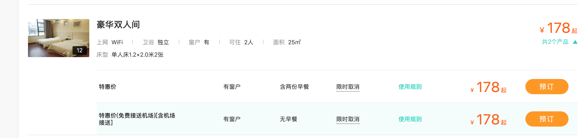
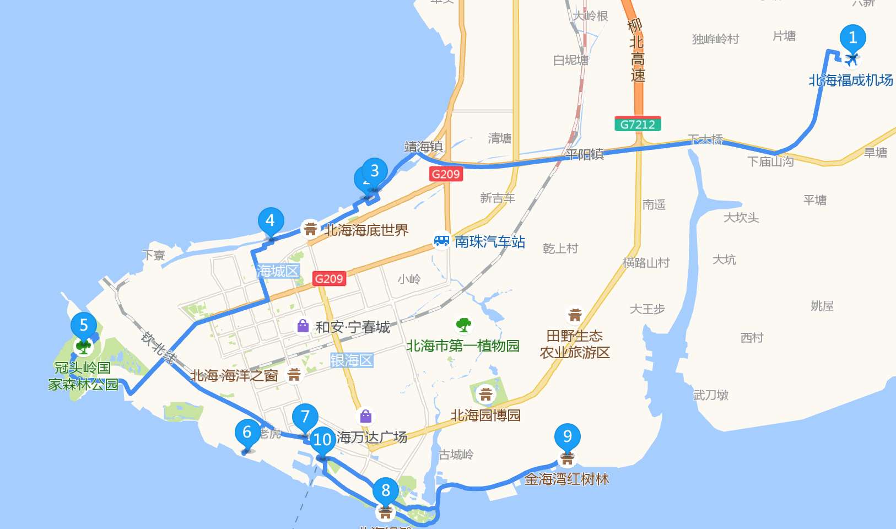
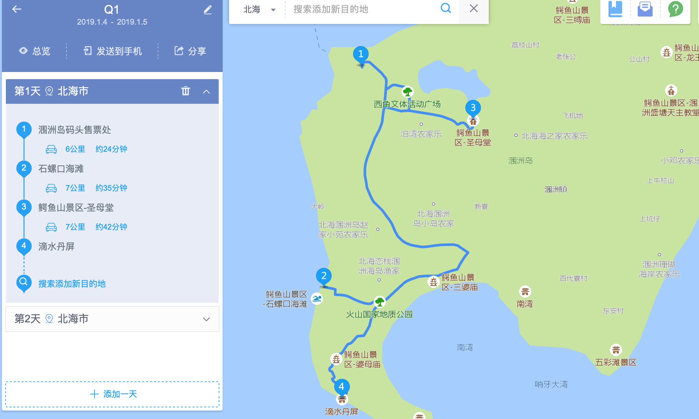
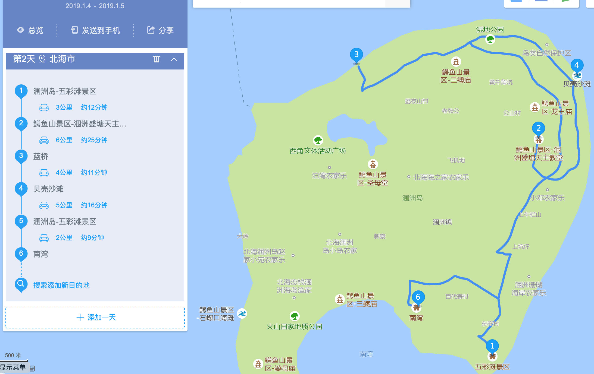

### `1.16`直✈️北海大学生行程安排

* 出发（`1.16 -- 1.17`）

  * Q1：武汉直达北海

    

  * Q2：武汉到南宁（`1.16`:）

    * 机票数目预计合适的就[两趟航班](https://flights.ctrip.com/itinerary/oneway/wuh-nng?date=2019-01-16)，这里选择一个性价比略高的，价格`420`

      

    * `22.35`到南宁**吴圩**国际机场，机场`5`公里内的酒店基本都有**接送服务**暂时可以不用考虑滴滴，这个**讨论**一下

    * [机场附近酒店](http://hotels.ctrip.com/hotel/nanning380/sl1951991#ctm_ref=hod_hp_sb_lst)，[美团](https://hotel.meituan.com/nanning/)

      * [瑞嘉便捷酒店(T2航站楼店)](https://hotel.meituan.com/150012198/?ci=2019-01-16&co=2019-01-17#comment)

        

        * 槽点比较少，`4.9`分，目前**预计的**入住
        * `90/人`

      * [南宁瑞泰航城大酒店](http://hotels.ctrip.com/hotel/3000532.html?isFull=F#ctm_ref=hod_sr_lst_dl_n_1_7)

        * 价格：`125/人`

        * 评分`4.5` 

        * 主要槽点是宾馆附近声音略吵，接送可能略坑

    * 南宁到北海（`1.17`），估计当天赶路，目前尚未安排[南宁行程](https://zhuanlan.zhihu.com/p/40121193)

    * [动车票](http://trains.ctrip.com/TrainBooking/Search.aspx?from=nanning&to=beihai&day=2019-01-17&number=&fromCn=%25E5%258D%2597%25E5%25AE%2581&toCn=%25E5%258C%2597%25E6%25B5%25B7&trainstype=gaotie-dongche)价格`58`：这里南宁站基本没有合适的票，建议早点去，保险一点

      

* 北海，后续部分多参考**知乎高票**回答、马蜂窝，如果直飞北海都可**向前**一天

  * 先`mark`景点，便于后续修改

    * 名人古迹人文景观目前认为本旅行团缺乏欣赏能力

  * 出行图

    

  * 预计行程（`1.17`中午到北海福成机场（`1`号点），`530`左右，纪念品另算？）

    * 北海湾（`2`号点）（`1.17`下午到，`1.18`中午走，不是银滩`70/人`）
      * [宾馆:北海爱旅游海景精品酒店公寓](https://hotel.meituan.com/67140421/?ci=2019-01-18&co=2019-01-19)
      * 海景大道（`3`号点）
        * 大概是傍晚，在这里散步、观海景下、看一下落日
        * 能起来话看一下日出？
      * 老街（`4`号点）
        * 晚上带少爷去吃海鲜
        * 饭：`65/人`的预算
    * 银滩（`1.18`中午到，`1.19`午走）
      * 和北海湾类似，`6、8`号点选宾馆位置，海景房**好的**的话目测`200/人`（看了十来家大概这个价）
      * `7`号点是侨港风情街
        * 饭：`65/人`的预算
      * `8`号点银滩日落日出？
    * 关于`5`号点和`9`号点二选一（`1.18`上午，估计雷哥大概率起不来，待定，消耗应该是车费）
      * [冠头岭国家森林公园](http://www.mafengwo.cn/poi/18972.html)
      * [北海金海湾红树林](http://www.mafengwo.cn/poi/5427065.html)
      * 优先级不高，过去`10`公里，滴过去来回`30`分分钟

* [涠洲岛](https://www.zhihu.com/question/20381905/answer/109060895)（`1.19中午批次`）`饭：300 + 睡：600 + 票：440 = 1340`

  * 船票以及上岛门票

    * `49` + `2*120` （美团，**PS**：评论有说现场买更便宜，注意）

  * 出行方式，观察天气待定，优先**推荐**小绵羊？（`3*50`）

    * 小绵羊
    * 观光车

  * 景点`mark`

    * [滴水丹屏](http://www.mafengwo.cn/poi/5423926.html)、[五彩滩](http://www.mafengwo.cn/poi/5423924.html) 
      * 看日出日落

  * 路线：

    

    * 石螺口系列（`1.19下午到`）

      * `1`号点是上岛的地方
      * 下午去找南湾找宾馆
        * 傍晚可以就在宾馆附近的[石螺口](http://www.mafengwo.cn/poi/5423925.html)
      * 晚上麻

    * 在南湾附近的宾馆（`1.20`）

      * 上午往`3`号景点去（估计是`10`点出门，所以只有一个景点）
        * 顺带去吃一下饭（农家乐）
      * `4`号点[滴水丹屏](http://www.mafengwo.cn/poi/5423926.html)区域（左下角）
      * 晚上喝酒

    * 五彩滩起点（ `1.21` 骑电驴耗时大致如左）

      

      * 早上起来[五彩滩](http://www.mafengwo.cn/poi/5423924.html)（`1`号点）看一下日出
      * 然后去[天主教堂](http://www.mafengwo.cn/poi/5423932.html)（`2`号点）
        * 中午可以在盛塘天主教堂周边吃顿正宗的川菜，或者喝杯咖啡，吃点简餐
      * 下午可以去[蓝桥](http://www.mafengwo.cn/poi/5877378.html)（`3`号点）
      * 中间会经过[彩色公路](http://www.mafengwo.cn/poi/5880225.html)到[贝壳沙滩](http://www.mafengwo.cn/poi/5865136.html)（`4` 号点）
      * 傍晚到从[贝壳沙滩](http://www.mafengwo.cn/poi/5865136.html)回[五彩滩](http://www.mafengwo.cn/poi/5423924.html)
        * 中间南湾市场买海鲜，在那边找店加工回去吃
      * 晚上麻或出去清吧（南湾（`6`号点）附近）

    * `1.22上午`睡醒出岛

  * 预算

    * 海景房：`1.19、1.20、1.21晚上睡` = `3*200`
      * 建议不换
    * 饭预算`3*100`
      * 海鲜略微不贵

* 北海到武汉（`1.22`）

  * 北海到武汉（`1.22`）

    

  * 在上面路线了北海到南宁到武汉`638`

* 预算：`530+1340+730*2 约等于 3500`

* 多带点钱